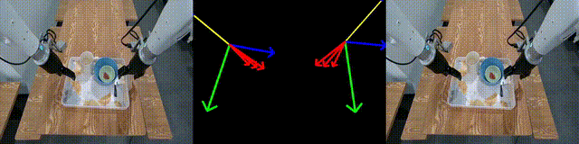
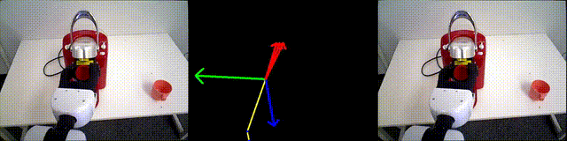
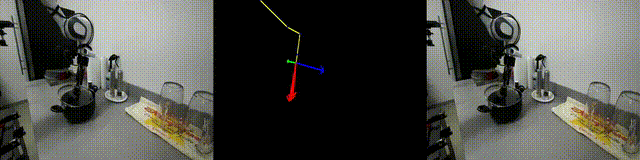
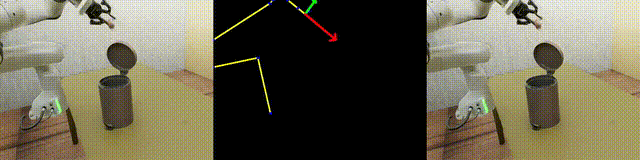
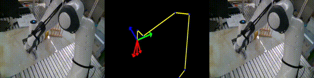
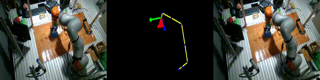
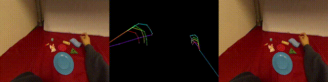
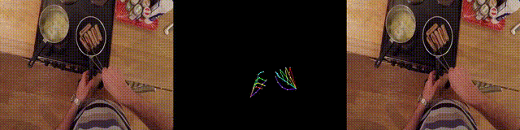

<div align="center">

# OSCAR: Omni-Embodiment Action-Conditioned World Model for Robotics

[Zhuoyuan Wu](https://wuzy2115.github.io)<sup>1</sup>  &nbsp;&nbsp;  [Jun Gao](https://www.cs.toronto.edu/~jungao/)<sup>2,3</sup>

<sup>1</sup> Peking University  &nbsp;&nbsp;  <sup>2</sup> University of Michigan  &nbsp;&nbsp;  <sup>3</sup> NVIDIA

<p>
  <a href="https://arxiv.org/abs/2606.04463"></a>
  &nbsp;
  <a href="https://wuzy2115.github.io/oscar-project-page/"></a>
  &nbsp;
  <a href="https://github.com/wuzy2115/oscar"></a>
</p>

<p>
  <a href="https://huggingface.co/zywu2115/OSCAR-2B"></a>
  &nbsp;
  <a href="https://huggingface.co/datasets/zywu2115/OSCAR_robot"></a>
  &nbsp;
  <a href="https://huggingface.co/datasets/zywu2115/OSCAR_human"></a>
</p>

</div>

> **Abstract.** We present <strong>OSCAR</strong>, a precise action-conditioned video world model that generalizes across different robot embodiments and enables robot policy evaluation. Existing video world models face three main challenges for real-world robot evaluation: limited scenario diversity in current robot training datasets, imprecise action following, and poor generalization across embodiments for broad adoption. We tackle these challenges from two perspectives. At its core is a large-scale standardized data pipeline that curates, filters, and deduplicates broad robotics and egocentric human datasets, yielding a clean joint-training dataset that spans diverse tasks, scenarios, actions, and robot embodiments. To condition the video model, we adopt 2D kinematic skeleton rendering as a unified conditioning representation that generalizes across different robot arms or even human hands. We finetune the Cosmos-Predict2.5-2B model on a single GH200 GPU. Our model achieves significant improvement on action following, appearance quality, and motion consistency, compared to existing baselines, which either have a much larger model size or require more GPUs. We further deploy <strong>OSCAR</strong> to evaluate robot policies from RoboArena. Extensive experiments demonstrate the significant correlation between our virtual policy evaluation in <strong>OSCAR</strong> and real-world evaluation, paving the way for the future where robot policies can be purely evaluated in virtual generated worlds.

## Gallery

Each tile shows *OSCAR output · skeleton conditioning · ground truth* for one embodiment.

<table>
  <tr>
    <td align="center" width="50%"><br><sub><b>AgiBot G1</b> · Bimanual</sub></td>
    <td align="center" width="50%"><br><sub><b>AIROA HSR</b> · Mobile Manipulation</sub></td>
  </tr>
  <tr>
    <td align="center" width="50%"><br><sub><b>DROID Franka</b> · Tabletop</sub></td>
    <td align="center" width="50%"><br><sub><b>InternData Franka</b> · Pick &amp; Place</sub></td>
  </tr>
  <tr>
    <td align="center" width="50%"><br><sub><b>RH20T Franka</b> · Contact-Rich</sub></td>
    <td align="center" width="50%"><br><sub><b>RH20T KUKA</b> · Contact-Rich</sub></td>
  </tr>
  <tr>
    <td align="center" width="50%"><br><sub><b>EgoDex</b> · Human Egocentric</sub></td>
    <td align="center" width="50%"><br><sub><b>EPIC-Kitchens</b> · Human Egocentric</sub></td>
  </tr>
</table>

## 🫨 News

- **2026-06-16** — Added a self-contained [skeleton rendering demo](demo/): renders a DROID (Franka + Robotiq) episode to show how robot proprioception becomes the 2D kinematic-skeleton conditioning signal — read state → URDF FK → project → overlay, CPU-only.
- **2026-06-16** — Released the [OSCAR policy-rollout videos](https://huggingface.co/datasets/zywu2115/OSCAR_policy_rollout): real-robot rollouts paired with OSCAR world-model rollouts from the RoboArena policy-evaluation experiment.
- **2026-05-14** — Initial release: OSCAR-2B model weights, inference CLI, and `oscar_diffusers` / `oscar_diffsynth` wrapper libraries.

## Quick Start

### Prerequisites

- Linux x86_64 with an NVIDIA GPU (≥ 24 GB VRAM recommended; tested on
  RTX PRO 6000 Blackwell, sm_120).
- CUDA 12.4+ runtime drivers.
- `uv` (`curl -LsSf https://astral.sh/uv/install.sh | sh`).
- `git`, `ffmpeg` (system-level — `imageio[ffmpeg]` bundles a userspace
  fallback if you can't install ffmpeg system-wide).

<details>
<summary>Optional: TransformerEngine (source build, FP8/Blackwell-optimized attention)</summary>

The inference path runs without TransformerEngine; it falls back to PyTorch SDPA. If you want the FP8/optimized attention kernels, build TE from source:

```
git clone --recursive https://github.com/NVIDIA/TransformerEngine.git
cd TransformerEngine
NVTE_FRAMEWORK=pytorch TORCH_CUDA_ARCH_LIST="12.0" pip install -v .
```

TransformerEngine is not currently shipped as a stable pip wheel for the CUDA 12.8 / Blackwell stack, hence the source build. Adjust `TORCH_CUDA_ARCH_LIST` to match your GPU (`9.0` for Hopper, `8.9` for Ada, etc.). Skip this section if you are happy with SDPA attention — the public benchmark cases were generated without TE.

</details>

### 1. Install (uv)

```
git clone https://github.com/wuzy2115/oscar.git
cd oscar
uv venv --python 3.10 .venv
uv pip install -r requirements_minimal.txt
```

### 2. Download model + assets

```
hf download zywu2115/OSCAR-2B --local-dir checkpoints/
```

Pulls `checkpoints/model/` (~5 GB, distributed checkpoint shards) and
`checkpoints/assets/` (~500 MB, 14 benchmark cases) in one go.

### 3. Run inference

```
bash scripts/run_inference.sh agibot_465
```

Output: `outputs/agibot_465.mp4` (81 frames, 480×640, H.264, ~7 MB).
Wall time on a single Blackwell GPU is ≈ 1 minute after the first warmup
load.

### 4. Library wrappers (diffusers / DiffSynth)

Both wrappers require the same environment from steps 1–2 above (they delegate to `inference._core` which imports `worldsim` internally). There is no standalone `pip install oscar_diffusers` path — clone the repo and install `requirements_minimal.txt` first.

Both wrappers produce bit-identical output at N=5 sampling steps (verified — SHA256 `e9bd9430d9828f4d` on `agibot_465` across all three surfaces).

```python
# diffusers-style
from oscar_diffusers import OSCARDiffusersPipeline
pipe = OSCARDiffusersPipeline.from_pretrained("zywu2115/OSCAR-2B")
out  = pipe.from_assets("agibot_465")(seed=42)
# out.frames is a list of np.uint8 (480, 640, 3) RGB arrays
```

```python
# DiffSynth-Studio-style
from oscar_diffsynth import OSCARDiffSynthPipeline
pipe = OSCARDiffSynthPipeline.from_dcp("checkpoints")
out  = pipe(
    first_frame="path/to/first.png",
    skeleton_video="path/to/gripper_scenario.mp4",
    prompt="robot grasps the bottle",
    num_inference_steps=35, guidance_scale=6.0, seed=42,
)
```

## Available cases (14)

| Embodiment   | Cases                                       |
|--------------|---------------------------------------------|
| `agibot`     | `agibot_465`, `agibot_360`                  |
| `droid`      | `droid_TRI`, `droid_AUTOLab_1202`           |
| `airoa`      | `airoa_ep000593`, `airoa_ep000719`          |
| `airoa_moma` | `airoa_moma_ep000755`, `airoa_moma_ep000963`|
| `interndata` | `interndata_ep936`, `interndata_ep1185`     |
| `rh20t_cfg5` | `rh20t_cfg5_103`, `rh20t_cfg5_0004`         |
| `rh20t_cfg7` | `rh20t_cfg7_34`, `rh20t_cfg7_0002`          |

Each `checkpoints/assets/<case>/` directory contains:

- `rgb.mp4` — ground-truth video (used by the dispatcher to extract the
  conditioning first frame at the case's `start_frame`).
- `gripper_scenario.mp4` — skeleton-conditioning input video.
- `caption.pickle` — text prompt source.

The dispatcher hardcodes the `start_frame` and per-case random seed values
needed to reproduce the bundled inference outputs.

## License

- Code: Apache-2.0 (see `LICENSE`).
